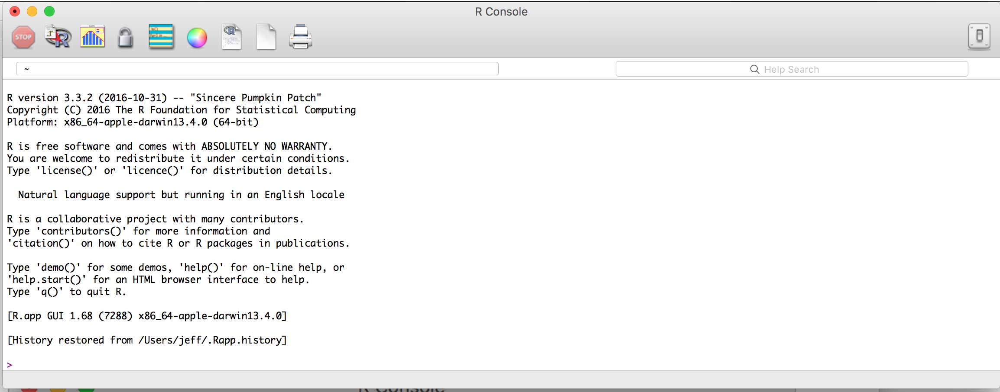
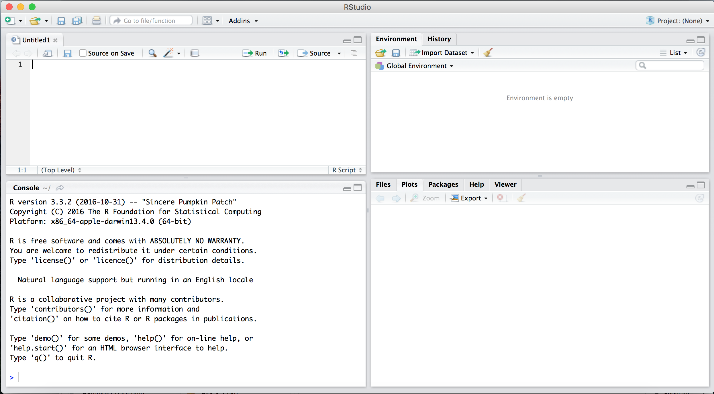

##An Introduction

Humans are good at many things and have an innate ability to understand matters of great complexity and originality. Our creative abilities have created the arts and much of science. However, scaling our abilities is often a matter of the number of hands and training those hands. Fortunately, advances in information sciences and statistics have given way to new capabilities that are scalable beyond what most may think is possible. 

According to a Pew Research Center [study](http://www.pewinternet.org/2015/10/29/technology-device-ownership-2015/), approximately 68% of Americans have smartphones and 73% of a desktop or laptop computer. These devices provide access to internet services that now are becoming smarter and automated and it doesn't take much to find examples of how algorithmic intelligence helps us in our daily lives.

A class of techniques known as computer vision is becoming more common for organizing photographs by the people and places on social media and software platforms. The same machine learning technologies are being used to detect urban development changes or count objects on the ground from satellite imagery, which can help natural scientists to do [count solar panels for energy policy](https://www.researchgate.net/publication/300416092_Automatic_solar_photovoltaic_panel_detection_in_satellite_imagery) or support prediction of [retail industry financial earnings](http://www.cnbc.com/id/38722872). Natural language processing is emerging as a common application to label topics in digitized documents so that lawyers and researchers can find the right information, screen for the general sentiment in media and corpuses in documents, and extract interpersonal relationships and identify big influencers in a network of people. There is now sufficient data of sufficient volume, variety and velocity to enable large scale risk identification using classification algorithms,  enabling health providers to find and help people who may visit the emergency room in the next six months, monitor for fraud in financial transactions or prevent disasters. 

The disciplines of machine learning, pattern detection and data analysis are part of what is now called "data science", an interdisciplinary field that uses statistics and computer science to take advantage of insights in data. Data scientists are often experts in computer programming or 'coding', mathematics, and communication. Programming is required to design and assemble information into actionable applications. The mathematics takes on more complex forms (e.g. machine and statistical learning) that are the engines that support the value-added insight of the applications. Communication is the social interface between the pure technical and the users. Together, these three skills can greatly advance the cause of a given subject matter domain. Data science skills led to the creation of ['People you may know' on LinkedIn](https://hbr.org/2012/10/data-scientist-the-sexiest-job-of-the-21st-century)  and satellite-based market intelligence at [Orbital Insight](https://orbitalinsight.com/orbital-insight-correctly-predicts-retail-sales-miss-hit-rate-grows-78/). In public policy, there has been an emergence of smart applications that support public operations from [fire risk prediction for public safety](http://www.smithsonianmag.com/innovation/how-data-and-good-algorithm-can-help-predict-where-fires-will-start-180954436/) to [tracking deforestation from satellites](http://www.forbes.com/sites/alexknapp/2015/04/22/satellite-data-and-a-i-will-be-deployed-to-predict-and-prevent-deforestation/#35c3f6987fdb). 

###Anatomy of a Data Science project
The anatonomy of a data science can be described using verbs, clustered into four steps.

- **<u>investigate/ask/design/collect</u>**. The goal in this step is to determine if there is indeed a data project to be undertaken. This requires understanding the client or user's needs and problems, exposing the context of those problems, determining whether the problem lends itself to a data-driven approach, and collecting the necessary data.  Typically, this work is done in conjunction with designers and operations experts to understand the context in which a data science project could work, taking into account the political issues that may influence the deployment of a data science project as well as the availability of data to develop the work. Often times, this step requires an expert with years of practice to to accurately assess if a problem can be solved using a data science approach and will not be covered in this course.
- **<u>explore/clean/reshape/analyze</u>**. The second step involves understanding the collected data, particularly its quirks, eccentricities, and reliable qualities. By conducting on *exploratory data analysis*, a data scientist will develop an intuitive understanding of the tolerances of the data, opportunities to clean and improve the data as well as reshape it for application. These tasks are covered in Lectures 1 through 4 with a particular emphasis on building and wrangling information.
- **<u>model/learn</u>**. The third step involves combining data to quantify predictable relationships or surface latent patterns that exist in the data. For cases where data are *labeled* or contain a target or dependent variable that one would like to better understand, a class of techniques known as *supervised learning* can be used to *train* an algorithm to find the relationship between input features or variables to reliably predict that target. Supervised learning methods can be used to quantify or assess causality using quasi-experimental methods, which is more common for program evaluation and social sciences, or be directly applied to *score* incoming data in order to help field operations through risk management and prioritization. In either case, supervised learning methods rely on objective functions or error functions to find the relative best answer.  Examples of supervised learning include linear regression and classifers. For data that do not contain labels or target data, *unsupervised learning* can be used to surface *clusters* or patterns by examining the proximity of records and natural breaks in input variables. K-means clustering and hierarchical clustering are common examples of unsupervised learning. These core techniques will be covered in Lectures 5 through 9.
- **<u>communicate/visualize/refine/deploy</u>**. The last step is focused on engaging and productizing the first three steps, mainly through communicating the insights and value proposition, often times through interactive visualizations and application development. Visualization should support insight as well as help users and clients develop their own organic understanding. In deployment, data science projects will often times be the underlying *engine* of an application -- the algorithmic intelligence that turns a web application into a smart application. Lectures 10 through 13 will focus on the last mile of data science projects.

Needless to say, none of this can be achieved without code.

###Ok, so where do I start?
To be contributor that can drive impact, the first step is to master assembly. In this course, we do so by first overcoming the coefficient of static friction in using a programming language, specificallt the statistical programming language [R](https://cran.r-project.org/) for statistics and data science. It should be noted that are a number of other open source languages, or programming code that is freely available and may be redistributed and modified, that are suitable for data science such as [Python](https://www.python.org/) and [Julia](http://julialang.org/). Typically, expert data scientists will be versed in more than one language, but R is a suitable language to start than any.

###R and RStudio
To make the most of R, you'll need to install two programs: R and RStudio. The former is the computing environment [R](https://www.r-project.org/) that has basic functionality to execute code, whereas the latter is an open-source integrated development enviroment (IDE) that makes coding in R a seamless experience. 

####Installation
#####To install R:
- Visit [R](https://cran.r-project.org/)
- Click on 'Download R' for your computer's operating system or OS (Windows, Linux or Mac)
- Download the latest **.pkg** file that your OS can support
- Open and install the **.pkg** file

Upon installing, open the software and your screen should look approximately like the following:
. 

#####To install RStudio
- Visit [RStudio](https://www.rstudio.com/products/rstudio/download/)
- Click on the Installer that corresponds to your computer's operating system or OS (Windows, Linux or Mac)
- Open and follow install instructions 
- In order for RStudio to work, it'll require both RStudio and R to be installed. Upon opening RStudio after installation, the program will prompt you to select the a version of R that has already been installed.

Upon installing, open the software and your screen should look approximately like the following:



##Fundamentals of R programming
R is an object-oriented programming (OOP) language that supports statistical analysis, graphing and data processing. It is an *interpreted language* that allows users to enter code into a command line interface. It also supports scripting. Throughout this course, follow along the examples by entering the commands into the command line or executing through your script editor. It may seem repetitive, but a large part of doing data science is committing the mechanics to muscle memory.

To start, let's set a `variable` x to the number `1`. Notice that assignments are expressed using `<-`. To check that the assignment worked, we'll use `print()` to write `people` to the console output.

```{r}
people <- 10 #Set x as a single value
print(people)
```

`people` was set as a numeric value. In statistial programming, there are many different data types, including:
- *numeric* (e.g. 1, 3.14, 123)
- *string* or *characters* (e.g. "text goes here")
- *factors* (e.g. unique levels)
- *boolean* (e.g. FALSE, TRUE)
- *dates* (e.g. 12/6/2016, 2014-03-20)

Thus, a variable can hold values of any data type and be overwritten with virtually anything:

```{r}
#string
    people <- "people"
#factor
  people <- factor("people")
#boolean
  people <- FALSE
#dates
  people <- as.Date("12/6/2016","%m/%d/%Y")
  
```

Variables can also hold more than one value. In the example below, we overwrite `people` as a vector, or a sequence of data elements of the same *data type*. 

```{r}
people <- c(134, 542, 324, 102, 402, 383, 853) #set x as a vector
print(people)
```

Let's assume that each element of vector `x` represents a different field office's productivity with serving constituents and we wanted to print out a simple summary. To do this, we'll rely on the `sum()` function to add all values in the vector x, `length()` to count the number of offices, and `paste()` to concatenate all the objects into one string object.

```{r}
tot_people = sum(people) #Sum of x
num_offices = length(people) #count number of elements
units1 <- "satisfied constituents served" #string variable
units2 <- "field offices!" #another string variable

statement <- paste(tot_people, units1, "in", num_offices, units2)
print(statement)
```

#####Quick Exercise
Using the `people` and `units` variables, write a command that lists the number of people people served per office.

###Numeric or arithmetic operators
Numerical values can be modified, manipulated, and combined using operations such as addition (`+`), substraction (`-`), multiplication (`*`), division  (`/`), exponent (`**`) and modulus (`%%`). These are the foundations of many analytical operations.

```{r, echo=FALSE}
4 + 2  #Addition
4 - 2  #Substraction
4 * 2  #Multiplication
4 / 2  #Division
4 ** 2 #Exponent
4 %% 2 #Modulus 
```

These operators are scalable. If we want to find the number of customers if we wanted to double productivity or half productivity, then it's like multiplying a scalar to every row in a given column of a spreadsheet. It's far easier to do this in R using one line of code.

```{r}
##Double
  doubled <- people * 2
  print(doubled)

##Half
  halved <- people / 2
  print(halved)
```

###Logical operators
Let's say that you need to  flag values based on specific values or specific thresholds. This task would require the use of logical operators, which evaluate a statement and return a boolean that indicates if a statement is `TRUE`. Below, we compare two quantities: `y` and `x`

```{r}
x <- 10
y <- 2

x > y   #4 is greater than 2
x >= y  #4 greater than or equal to 2

x < y   #4 is less than 2 
x <= y  #4 less than or equal to 2

x != y  #4 is not equal to 2
x == y  #4 is equal to 2
```

Using the operators, we can also see how many elements in a vector meet a specific criterion. For example, to flag which records in `people` are over 200, we can do the following:
```{r}
above <- people>200
print(above)
```

Notice that the logical operator returned a vector that evaluate the statement for each element in `people`. To see the split of `TRUE` vs. `FALSE`, we an use the `table()` function to tabulate the number of records in each unique data value. 
```{r}
table(above)
```

###Data Classes 
Data classes are ways to store data in an efficient and usable manner within the R programming environment. These differ from data storage formats (e.g. CSV, JSON), which are widely used regardless of programming language. Each data class is designed with different functions in mind and make certain tasks more efficient. In this section, we'll cover vectors, lists, matrices, and data frames. 

#####Vectors
As mentioned previously, *vectors* are sequences of data elements of the same data type. Below, there are three vectors: `cities` is a string vector whereas `pop` and `area` are numeric vectors.

```{r}
cities <- c("New York","Los Angeles","Chicago","Houston","Philadelphia")
pop <- c(8175133, 3792621, 2695598, 2100263, 1526006)
area <- c(302.6, 468.7, 227.6, 599.6, 134.1)
```

To extract specific values in a vector, we will need call values by their index position in the list of values. Unlike other programming languages, R index values start from 1 rather than 0. Thus, in order to obtain the first value in all three vectors, one could write the following command:

```{r}
cities[1]
pop[1]
area[1]
```

Using the index values to extract values is quite useful and can be combined in many ways:
```{r}
#Obtain first and fourth cities
  cities[c(1,4)]

#Obtain the third through fifth cities
  cities[3:5]
  
#Use criterion to obtain populations greater than 2 million
  pop[pop>2000000]
  
```

#####Matrices
Vectors can be combined into into a *matrix* using `cbind()`. Matrices are data elements arranged into a `n` row by `m` column rectangular layout that allow for easier multi-dimensional data manipulation. Note that all data elements, regardless of the location in a matrix, are of the same data type (e.g. numeric, string, boolean) and take on the data type of the first column of data unless specified otherwise.

```{r}
mat <- cbind(cities, pop, area)
```

In this case, `pop` and `area` take on the data type of `cities`. This can be limiting if an analysis requires multi-dimensional, multi-data type data. But there benefits over vectors, namely the ability to easily and concisely extract complete multiple variable sets of data.

```{r}
#Extract first row
  mat[1,]

#Extract second column
  mat[,2]
  
#Extract 2nd to 3rd rows and the 1st and 3rd column
  mat[2:3,c(1,3)]
```

#####Data frames
If a dataset will have more than one data type, consider using data frames. To create a data frame, use the `data.frame()` to put two or more vectors together. 

```{r}
df <- data.frame(city = cities, population = pop, area = area)
```

One of the properties of data frames is the ability to set, manage and use  variable names, which is not available when using matrices.

```{r}
#Being able to call a variable by name using the compact $ operator
  df$cities
  df$population

#Check column names
  colnames(df)
  
#Reassign column names using a vector of 
  colnames(df) <- c("city_name","pop","area")
  
#Create a new boolean variable for populations greater than 2.5m and store into data frame
  df$over_2m <- df$pop > 2500000

#View results
  print(df)
```

If there is a existing matrix object, `as.data.frame()` an be used to convert the objet into a data frame. However, this method will preserve the uniform data type of the matrix, which would require manually setting the data type for each variable.

```{r}
new_df <- as.data.frame(mat)
```

#####Other helpful tips
We can check the structure of any data object in R using the `str()` method, which returns the following for a given data object:
- the data format if vector, or class if matrix or data frame
- dimensions of the data: number of rows if vector, matrix dimensions [rows, columns], or number of variables and rows if data frames
- the first 5 values of the object along with the data format

```{r}
#vector
  str(cities)
  str(pop)

#matrix
  str(mat)

#data frame
  str(df)
```

Other tools include `dim()`, `class()`, and `typeof()`, which provide the object dimensions, the class of data object and the type of data objet, respectively. These are handy for understanding basic attributes of any data and can inform the architecture of your data science approach.

```{r}
dim(df)
class(df)
typeof(df)
```

##Libraries
While R comes pre-packaged with a lot of basic functionality as described above, it is often necessary to install and load code libraries that contain higher-level functionality. As R is an open source language, anyone can write and contribute code libraries for general public use. In fact, as of Dec 2016, there are 9,749 contributed packages on the [Comprehensive R Archive Network (CRAN)](https://cran.r-project.org). Some of the most used libraries include:

- ggplot2 -- a graphing visualization library
- dplyr -- a data manipulation and processing library
- caret -- a multifaceted machine learning library
- stringr -- a library for character or string processing
- lubridate -- a library to handle date data
- sqldf -- a library to write SQL code

###Install and load
To start, we will install, load and demonstrate how to use *ggplot2*. Installation is simple enough, using the `install.packages()` method:

```{r, eval=FALSE}
install.packages("ggplot2")
```

To use the library, use `library()` to load *ggplot2*.
```{r}
library(ggplot2)
```

Upon doing so, all is needed is the data in the right form and a basic understanding of ggplot2 syntax ([take a look here](http://docs.ggplot2.org/current/)).

###An easy demo
For an initial demo, we will learn to load in a Comma Separated Values (CSV) file containing energy data from the [National Institute of Standards and Technology Net Zero Residential Test Facility](https://pages.nist.gov/netzero) -- a laboratory that produces as much energy as it uses and is a testbed for sustainable and efficient home technologies. The specific dataset that will be used is the hourly photovoltaic sensor dataset [https://s3.amazonaws.com/net-zero/2015-data-files/PV-hour.csv](https://s3.amazonaws.com/net-zero/2015-data-files/PV-hour.csv), which contains hourly estimates of solar energy production and exposure on the Net Zero home's solar panels. From a sustainability perspective, this data can eventually be used to inform home efficiency policies, solar panel siting, among other things. Our goal in this demonstration is to plot sun exposure by month to see the relative differences. 

To start, we'll use the `read.csv()` function to import the object at the `url` destination that contains the the CSV dataset and assign the resulting dataframe to the object `df`.
```{r}
  url <- "https://s3.amazonaws.com/net-zero/2015-data-files/PV-hour.csv"
  df <- read.csv(url)
```

With the dataset imported, we will now check the data by using `head()` to print the first three lines of data, `colnames()` to see the names of all variables, and `str()` to look at the data structure.
```{r}
  head(df,3)
  str(df)
```

Based on initial examination, the dataset contains 34 variables with over 8,000 observations where *Timestamp* is the only date variable. However, while the variable contains information on dates, R treats the *Timestamp* as a factor. In order to accomplish the goal of this demo, we would need to: 
- (1) convert the *Timestamp* variable into a date-time object using `strptime()`, which requires the user to identify the date pattern so that R can extract the right information. In the case of the PV data, the format is in "%Y-%m-%d %H:%M:%S" or "Year-Month-Day Hour:Minute:Second". 
- (2) extract the month from the date object using `format()`, which only requires the date object and the desired output format. In this case, the output format is "%m"

```{r}
  df$Timestamp <- strptime(df$Timestamp, "%Y-%m-%d %H:%M:%S")
  df$month <- format(df$Timestamp, "%m")
```

Upon doing so, we can now graph the data. Of particular relevance to our analysis is the *PV_PVInsolationHArray* variable that contains an estimate of amount of sunlight that impacting the solar array during the last hour. R has a number of rudimentary graphing capabilities such as `plot()`, which accepts two vectors of data and renders a scatter plot. Below, `plot()` outputs a scatter plot where *month* is the x or horizontal axis variable and *PV_PVInsolationHArray* as the y or vertical axis variable.

```{r}
  plot(df$month,df$PV_PVInsolationHArray)
```

The result is not particularly compelling or meaningful as the points are too many and too dense to discern a pattern. The graph could use use style enhancements. Perhaps boxplot would be more suitable to summarize the shape of the PV distribution for each month.

Enter *ggplot2*.

```{r}
library(ggplot2)
```

Upon loading the *ggplot2* library, we can quickly get to work. The bare minimum syntax to render a stylized boxplot:

```{r, eval=FALSE}
ggplot([dataframe goes here], aes([x value here], [y value here])) + 
  geom_boxplot(colour = "[colour]", fill = "[colour]")  
```

Putting this into action yields the following:
```{r}
ggplot(df, aes(factor(month),PV_PVInsolationHArray)) + 
  geom_boxplot(colour = "grey", fill = "navy")  
  
```

From this graph, we can see the peak sunlight months are between May and August where May and August. The third quartile (the upper end of each box) is protracted in May and August, indicating that there are hourly periods where the light is more intense during those months. 


###RMarkdown
Virtually all class notes will be written in R Markdown, a lightweight markup language that can weave text and R code together. Notes will come with both an R Markdown file and a "knitted" HTML file (the R Markdown file run and stored as an HTML web page). Class assignments should be submitted in RMarkdown. Review the following  [tutorial](http://rmarkdown.rstudio.com/r_notebooks.html) to get a feel for how this works.

###Getting started with Github
We will be using Github to access course materials as well as keeping track of the progress on your class project. To get started with Github, review this [tutorial](https://guides.github.com/activities/hello-world/).

##Appendix: Data Formats
There are many data storage formats that vary across fields and use cases. The table below provides an overview of the data storage type, format and use.

| **Abbreviation**  | **Name + Description** | **Type** |**Example** | **Fields of Use ** | 
|-------+---------------------+---------+--------------------------------------+--------------------|-------|
| CSV | Comma Separated Values | Tabular | state, pop_mil <br> California, 38.8 <br> Delaware, 0.936 | Widely used format in most fields|
| TSV | Tab Separated Values | Tabular | state    pop_mil <br> California    38.8 <br> Delaware    0.936 | Widely used format in most fields|
| JSON  | JavaScript Object Notation | Tabular | [{"state": "California", "pop_mil": 38.8},<br>{"state": "Delaware", "pop_mil": 0.936}] | A common format provided from APIs |
| XML | Extensible Markup Language | Tabular | \<data><br>&nbsp;&nbsp; \<rec> <br> &nbsp; &nbsp;&nbsp;   \<state>California \</state><br> &nbsp; &nbsp;&nbsp;   \<pop_mil>38.8 \<pop_mil><br> &nbsp;&nbsp;\</rec> <br> &nbsp;&nbsp; \<rec> <br> &nbsp; &nbsp;&nbsp;   \<state>Delaware \</state><br> &nbsp; &nbsp;&nbsp;   \<pop_mil>0.936 \<pop_mil><br> &nbsp;&nbsp;\</rec><br> \<\data>| Widely used format in most fields|
| SHP | Shapefile | Spatial | Contains four files: .shp, .shx, .sbn, .dbf   | Common format for Geographic Information Systems (GIS) |
| GeoJSON | GeoJSON | Spatial  |   | Common format for web-based GIS |
| TIFF | Tagged Image File Format | Spatial + Imagery  |   | Common format for representing grid-based|
| HDF | Hierarchical Data Format | Spatial + Imagery  |   | Common format for representing grid-based|
| NetCDF | Network Common Data Form (NetCDF) for sharing array-oriented scientific data | Spatial + Imagery  |   | Common format for representing grid-based|

